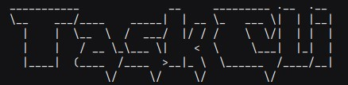

# Task Tracker CLI Tool

## Overview

Task Tracker is a command-line tool for managing tasks efficiently. This project is built using Java and Maven and utilizes the Picocli library for command-line argument parsing. It allows users to track their tasks with features for adding, updating, deleting, listing, and searching tasks. Tasks are persisted in a `tasks.json` file.



## Features

*   Add Tasks: Create new tasks with a description and optional status.
*   Update Tasks: Modify the description and/or status of existing tasks.
*   Delete Tasks: Remove tasks from the task list.
*   List Tasks: Display all tasks or filter by status.
*   Search Tasks: Search tasks by keyword, finding the closest matches in task descriptions using Levenshtein distance.
*   Persistence: Tasks are saved to and loaded from a `tasks.json` file.

## Installation

### Prerequisites

Ensure you have the following installed on your system:

*   Java JDK 11+ (https://www.oracle.com/java/technologies/javase-downloads.html)
*   Apache Maven (https://maven.apache.org/download.cgi)

### Building the Project

1.  Clone the repository:

    ```
    git clone <repository-url>
    cd TaskTracker
    ```

2.  Build the project using Maven:

    ```
    mvn clean install
    ```

    This will generate a `.jar` file inside the `target/` directory.

## Running the CLI Tool

To run the CLI tool, execute the following command from the project directory:

```
java -jar target/TaskTracker-1.0-SNAPSHOT.jar <command> [options] [arguments]
```

Replace `<command>`, `[options]`, and `[arguments]` with the desired command, options, and arguments. See "Usage" section for available commands.

## Usage

The `tcli` tool provides the following commands:

*   `add`: Adds a new task.
   *   `DESCRIPTION`: The description of the task.
   *   Options:
        *   `-s, --status`: The status for the task (TODO, IN_PROGRESS, DONE). Defaults to TODO if not specified.

Example:

```
java -jar target/TaskTracker-1.0-SNAPSHOT.jar add "Buy groceries" -s IN_PROGRESS
```

*   `update`: Updates an existing task.
   *   `ID`: The ID of the task to update.
   *   Options:
      *   `-d, --description`: Updated description.
      *   `-s, --status`: Updated status (TODO, IN_PROGRESS, DONE).

Example:

```
java -jar target/TaskTracker-1.0-SNAPSHOT.jar update <task_id> -d "Buy organic groceries" -s DONE
```

*   `delete`: Deletes a task.
   *   `ID`: The ID of the task to delete.

Example:

```
java -jar target/TaskTracker-1.0-SNAPSHOT.jar delete <task_id>
```

*   `list`: Lists tasks.
   *   Options:
      *   `-s, --status`: Filter tasks by status (TODO, IN_PROGRESS, DONE).

Example:

```
java -jar target/TaskTracker-1.0-SNAPSHOT.jar list -s TODO
```

*   `search`: Searches task descriptions for a keyword.
   *   `keyword`: The keyword to search for.
   *   Options:
      *   `-k`: The number of top matching tasks to return (defaults to 5).

Example:

```
java -jar target/TaskTracker-1.0-SNAPSHOT.jar search "groceries" -k 3
```

*   `-h, --help`: Displays help/usage information.

## Creating a Shortcut Script

To simplify execution, you can create a script.

### Windows (Batch File)

1.  Create a file named `tcli.bat` in the project root.
2.  Add the following content:

    ```bat
    @echo off
    cd /d "%~dp0"
    java -jar "target/TaskTracker-1.0-SNAPSHOT.jar" %*
    ```

3.  Now, you can run the tool with:

    ```
    tcli <command> [options] [arguments]
    ```

### Linux/macOS (Shell Script)

1.  Create a file named `tcli` in the project root.
2.  Add the following content:

    ```sh
    #!/bin/bash
    cd "$(dirname "$0")"
    java -jar "target/TaskTracker-1.0-SNAPSHOT.jar" "$@"
    ```

3.  Make the script executable:

    ```
    chmod +x tcli
    ```

4.  Now, you can run the tool with:

    ```
    ./tcli <command> [options] [arguments]
    ```

### Making It Globally Accessible

To run the tool from any directory:

1.  Add the project directory to the system `PATH`:
   *   On Windows:
      *   Open *System Properties* -> *Advanced* -> *Environment Variables*.
      *   Under *System variables*, find `Path` and edit it.
      *   Add the absolute path of the project root.
   *   On Linux/macOS:

       ```sh
       echo 'export PATH="$HOME/path-to-project:$PATH"' >> ~/.bashrc
       source ~/.bashrc
       ```

2.  Now, you can run the tool from anywhere using:

    ```
    tcli <command> [options] [arguments]
    ```

## Task Status

The following statuses are supported:

*   `TODO`
*   `IN_PROGRESS`
*   `DONE`

## Error Handling

The CLI provides error messages for invalid input, such as incorrect task IDs or invalid status values.

## JSON Structure (tasks.json)

The `tasks.json` file stores tasks in the following JSON format:

```json
[
  {
    "id": "unique_id",
    "description": "Task description",
    "status": "TODO",
    "createdAt": "yyyy-MM-dd HH:mm:ss",
    "updatedAt": "yyyy-MM-dd HH:mm:ss"
  }
]
```

## Developer Notes

*   The project uses the Picocli library for command-line argument parsing.
*   The Levenshtein Distance algorithm (from Apache Commons Text) is used for fuzzy searching of tasks.
*   Tasks are persisted to a JSON file for data storage.
